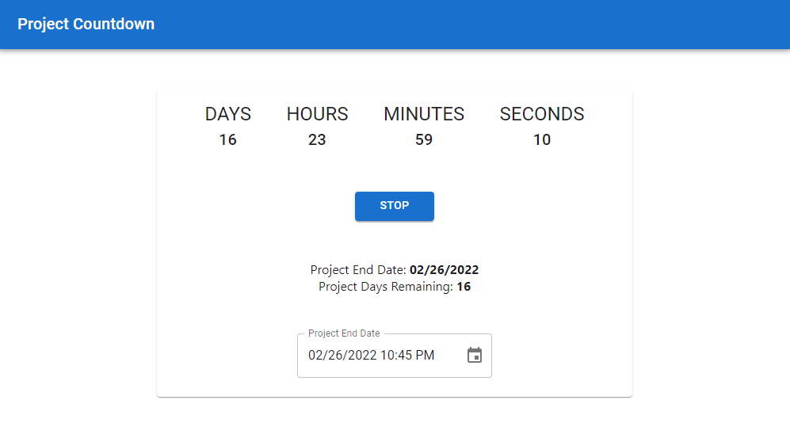

# Project Countdown

A simple app that explores React features using a project completion countdown timer.

## Concepts Covered
NOTE: _Links go to code lines/blocks_.

### Major:
* Importing child components into parent components ([App.js](/src/App.js#L36-L37))
* _Functional components_ with state managed through `useState()` ([Timer.jsx](/src/components/timer/Timer.jsx#L30-L33))
* _Class components_ with state managed through `this.state`/`setState()` ([Countdown.jsx](/src/components/countdown/Countdown.jsx#L5-L21))
* Component lifecycle methods in Class components ([Countdown.jsx](/src/components/countdown/Countdown.jsx#L23-L43))
* Passing props to child components and the subsequent consumption of those props ([Timer.jsx](/src/components/timer/Timer.jsx#L53) -> [Countdown.jsx](/src/components/countdown/Countdown.jsx#L79))
* Dynamic rendering using `Object.entries().map()` ([Countdown.jsx](/src/components/countdown/Countdown.jsx#L84-L95))
* Returning HTML elements from pure functions ([Timer.jsx](/src/components/timer/Timer.jsx#l9-L28))
* Making asynchronous API requests with `useEffect()` ([Timer.jsx](/src/components/timer/Timer.jsx#L39-L46))
* Calling an api asynchronously with `fetch()` ([DateProcessor.js](/src/api/DateProcessor.js))
* Various common Material UI components (Header, Card, Tooltip, TextField, Button, Datepicker)

### Minor:
* Using `LocalizationProvider` and `DateAdapter` with [Moment.js](https://momentjs.com/)
* Fake APIs calls for client-side testing using [Mirage](https://miragejs.com/)

## Screenshot

## Available Scripts

First, run `npm install` from your terminal to install the dependencies.

Then, in the project directory run from your terminal:

### `npm start`

Runs the app in the development mode.\
Open [http://localhost:3000](http://localhost:3000) to view it in your browser.

The page will reload when you make changes.\
You may also see any lint errors in the console.

## Getting Started with Create React App

This project was bootstrapped with [Create React App](https://github.com/facebook/create-react-app).